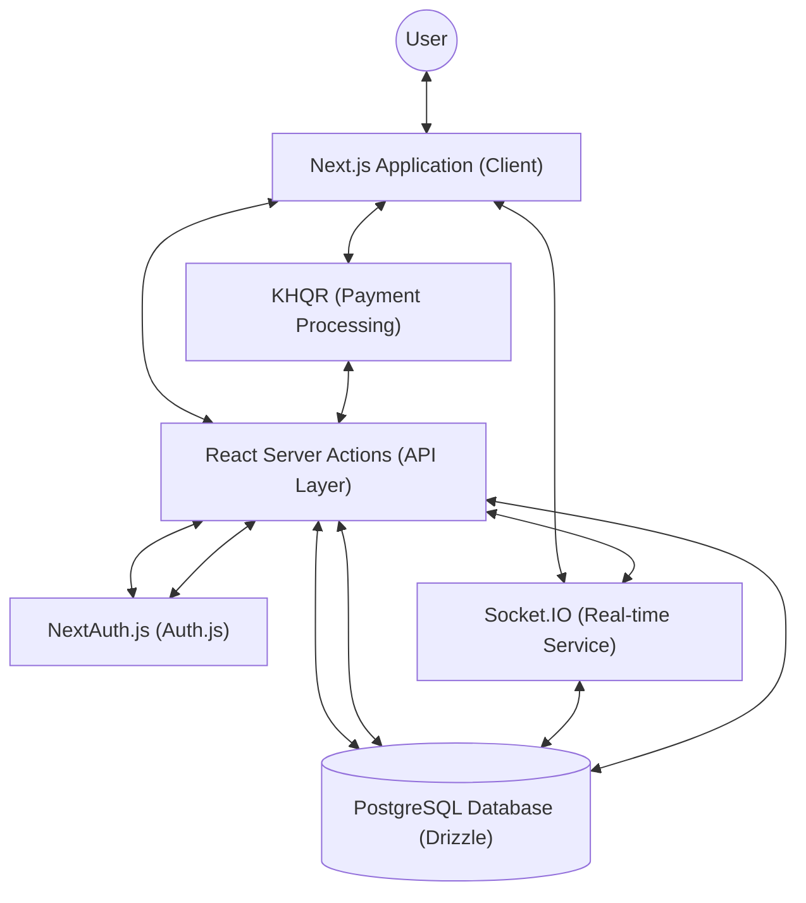

# Ecommerce Frontend

[](https://nextjs.org/)
[](https://www.typescriptlang.org/)
[](https://tailwindcss.com/)
[](https://authjs.dev/)
[](https://orm.drizzle.team/)
[](https://www.postgresql.org/)
[](https://socket.io/)
[](https://threejs.org/)
[](https://gsap.com/)

A high-performance, minimalist e-commerce platform built with Next.js 16 and modern web technologies. Focuses on premium aesthetics, real-time interactivity, and a robust server-side architecture.

## Overview

This project serves as the primary frontend for a modern e-commerce experience. It utilizes the latest features of Next.js, including the App Router and Server Actions, to provide a seamless and secure shopping interface. The design philosophy adheres to "Minimalist 2.0," emphasizing clean lines, purposeful animations, and a refined user journey.

### System Architecture



## Core Features

- **Real-time Synchronization** – Integrated with Socket.IO for live cart updates and order tracking notifications.
- **Server-Driven Logic** – Leveraging React Server Actions for secure and efficient data mutations and form handling.
- **Premium Aesthetics** – Dynamic UI components built with Framer Motion, GSAP, and Three.js for a high-end visual experience.
- **Secure Authentication** – Robust user management via NextAuth.js v5, supporting both OAuth providers and credential-based login.
- **Type-Safe Development** – End-to-end type safety using TypeScript and Zod for schema-based validation.
- **Database Architecture** – High-performance data access layer using Drizzle ORM with PostgreSQL.

### Interactive Highlights

- **Dynamic Hero Sections** – Implemented using Three.js and `three-custom-shader-material` for immersive landing experiences.
- **Smooth Content Transitions** – Powered by GSAP and Framer Motion for non-intrusive, fluid UI feedback.
- **Responsive Animations** – Optimized motion paths that adapt to device capabilities and user preferences.

## Technology Stack

### Framework & Language
- Next.js 16 (App Router)
- TypeScript
- React 19

### Interface & Styling
- Tailwind CSS 4
- Framer Motion
- GSAP
- Radix UI Primitives
- Lucide React Icons

### State & Data Handling
- Drizzle ORM
- NextAuth.js v5 (Auth.js)
- Zod (Validation)
- Socket.IO (WebSockets)
- Axios

### Visuals & Motion
- Three.js
- Tailwind CSS Animate

## Project Structure

The codebase follows a feature-centric modular architecture located within the `src` directory:

- `src/app` – Route definitions and page layouts using the App Router.
- `src/actions` – Server-side functions for data mutations (Auth, Cart, Orders).
- `src/components` – Reusable UI primitives and domain-specific components.
- `src/lib` – Configuration and utilities for database, authentication, and WebSockets.
- `src/validations` – Centralized Zod schemas for application-wide data integrity.

## Getting Started

### Prerequisites

- Node.js 20+
- pnpm (Recommended) or npm

### Environment Configuration

Create a `.env.local` file in the root directory and configure the following variables:

| Variable | Description |
| :--- | :--- |
| `DATABASE_URL` | Connection string for the PostgreSQL database. |
| `GOOGLE_CLIENT_ID` | Client ID from the Google Cloud Console for OAuth. |
| `GOOGLE_CLIENT_SECRET` | Client Secret from the Google Cloud Console for OAuth. |
| `NEXTAUTH_SECRET` | A random string used to hash tokens and sign cookies. |
| `NEXTAUTH_URL` | The base URL of your application (e.g., `http://localhost:3000`). |
| `STRIPE_API_KEY` | Your Stripe secret API key for payment processing. |
| `STRIPE_WEBHOOK_SECRET` | Secret key for verifying Stripe webhooks. |

### Installation

1. Clone the repository:
   ```bash
   git clone https://github.com/laytonglee/ecommerce-frontend.git
   cd ecommerce-frontend
   ```

2. Install dependencies:
   ```bash
   pnpm install
   ```

3. Set up environment variables:
   Copy `.env.local.example` to `.env.local` and populate the required keys.

### Development

Start the development server:
```bash
pnpm run dev
```

The application will be available at `http://localhost:3000`.

## Available Scripts

- `pnpm run dev` – Starts the development server.
- `pnpm run build` – Compiles the application for production.
- `pnpm run start` – Runs the built production server.
- `pnpm run lint` – Executes ESLint to check for code quality.
- `pnpm run db:generate` – Generates SQL migrations from the Drizzle schema.
- `pnpm run db:migrate` – Applies pending migrations to the database.
- `pnpm run db:push` – Synchronizes the schema directly with the database.
- `pnpm run db:studio` – Opens the Drizzle Studio database explorer.
- `pnpm run seed` – Populates the database with initial sample data.

## License

This project is privately licensed. See the project owner for details.
